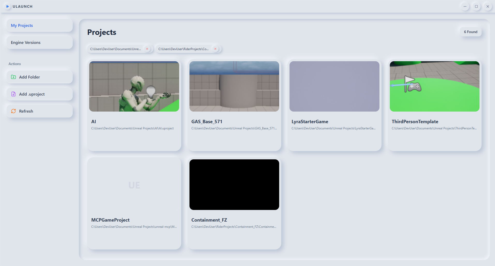

# ULaunch

ULaunch is a lightweight Unreal Engine launcher built with Tauri, React, TypeScript, and Rust. It helps you find local `.uproject` files, detect installed Unreal Engine versions, and launch projects or engines from one desktop app.



## Features

- Scan folders or add individual `.uproject` files
- Detect installed Unreal Engine versions from standard Epic Games paths
- Launch Unreal projects directly from the app
- Open matching `.sln` files when they exist
- Show project screenshots from `Saved/AutoScreenshot.png`

## Stack

- Tauri 2
- React 19
- TypeScript
- Rust
- Tailwind CSS
- Bun for package management and scripts

## Getting started

### Prerequisites

- [Bun](https://bun.sh/)
- Rust toolchain
- Windows machine with Unreal Engine projects or installs to manage

### Install dependencies

```bash
bun install
```

### Run in development

```bash
bun run tauri dev
```

### Build the desktop app

```bash
bun run tauri build
```

## Release build

Windows release artifacts are written to `src-tauri/target/release/bundle/`.

- MSI installers are generated in `src-tauri/target/release/bundle/msi/`
- NSIS installers are generated in `src-tauri/target/release/bundle/nsis/`

## Project structure

- `src/` - React frontend
- `src-tauri/src/` - Rust backend commands and app bootstrap
- `src-tauri/tauri.conf.json` - Tauri app configuration

## Notes

- Saved scan paths are persisted with the Tauri store plugin
- Engine detection currently checks common Epic Games install directories on Windows
